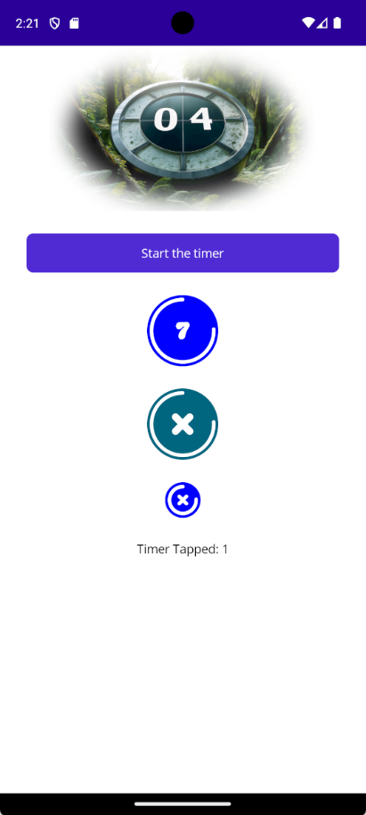

# TimerButtonDemo

A .NET 9 MAUI demo to illustrate how to create a control using the GraphicsView

There is an issue where using a custom font with Windows will cause an exception to be thrown. The calls to canvas.GetStringSize() and/or canvas.DrawString() will throw a System.ArgumentException exception with the message "Value does not fall within the expected range".

The code in TimeButtonDrawable.Draw() uses a try/catch block to trap the exception.

The Baking Sauce font included with this demo is licensed as Free for Personal Use.  See [baking-sauce-font](https://www.1001fonts.com/baking-sauce-font.html) for licensing information.